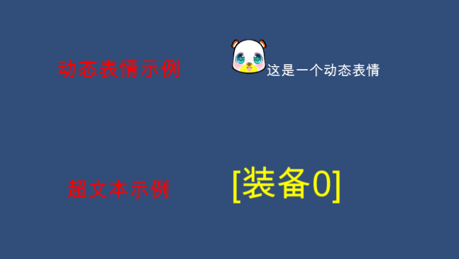

# uGui-ExText
Unity3d UGUI 动态表情，文本超链接
# Example(示例)

# Explain(说明)
## 重要参数方法
1.max_count-动图最大张数

2.gapTime-刷新帧速

3.m_spriteTagRegex-动态表情正则表达

4.s_HrefRegex-超文本正则表达

5.onHrefClick-超文本事件

## 文本示例
1.动态表情< quad X size=100 0>
X:表情id   100:表情大小    0:表情图片张数(0为静态表情)

2.超文本链接< a X>[装备]</ a>
X:超文本id

## 实现方法
1.动态表情包:
(1).带有组件ExText,SpriteGraphic

(2).XXX.asset挂脚本SpirtAsset

(3).XXX.asset设置TexSource和ListSpriteInfo

(4).TexSource为图集,ListSpriteInfo为每张图片设置

(5).SpriteGraphic组件挂资源XXX.asset

2超文本实现:
(1).带有组件ExText

(2).extext.onHrefClick.AddListener(Onclick);

(3).Onclick方法只有一个参数,string
